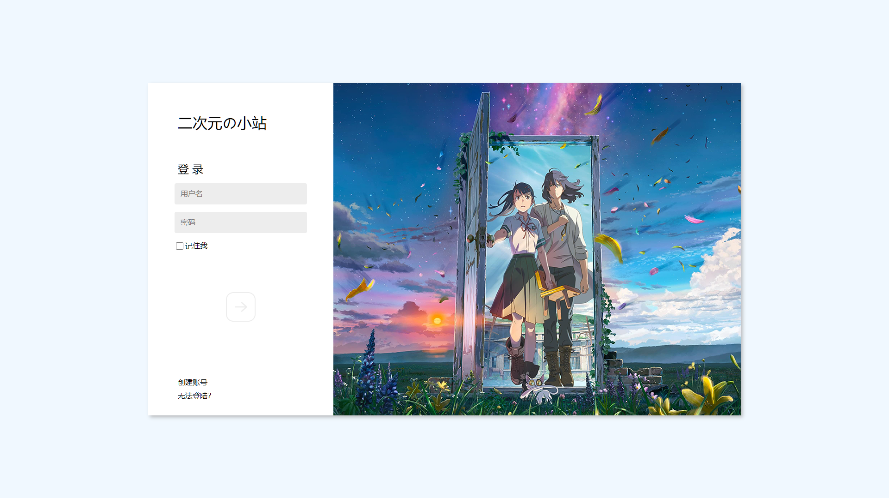

# 二次元の小站登录页面

名称：二次元の小站登录页面

作者：KSaMar

日期：2023-6-4

描述：一个简洁好看的二次元登陆页面

## 开发环境

网页制作工具：VSCode

## 简介

一个简单的前端登录页面，配合 JavaScript 实现了随机登录背景

可自行添加背景图片，大小为 880px x 720px

## 项目图片

## Bilibili

欢迎在 B 站上关注我

[哔哩哔哩](https://space.bilibili.com/51110915) KSaMar